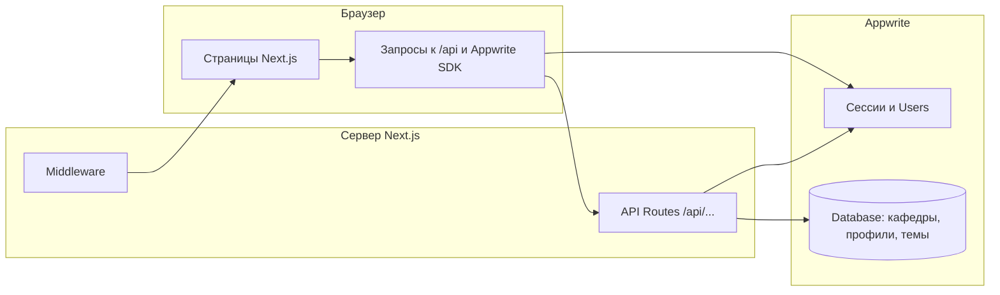

# Описание для защиты выпускной квалификационной работы

Документ предназначен для **демонстрации на защите**: что видно на экране в веб-интерфейсе, какие задачи решает система и **как устроена работа** «от клика до данных». Практическое руководство по кнопкам — в [`USER_GUIDE.md`](./USER_GUIDE.md).

---

## 1. Цель и предмет разработки

**Цель:** автоматизировать учёт тем выпускных квалификационных работ (ВКР) по кафедрам, разграничить доступ администратора и оператора кафедры и **снижать риск дублирования** формулировок тем в рамках одной кафедры.

**Реализация:** одностраничное веб-приложение на базе **Next.js 15** (маршруты App Router) с бэкендом **Appwrite** (аутентификация, база данных, пользователи). Бизнес-логика чувствительных операций вынесена в **серверные API-маршруты** приложения (`/api/...`), чтобы права и фильтрация данных не зависели только от клиента.

---

## 2. Что показывается на фронтенде (сценарий демонстрации)

Ниже — логичный порядок показа для комиссии: от входа до типовых действий по ролям.

### 2.1. Визуальный стиль интерфейса

На экране после входа пользователь видит **единую оболочку** приложения: тёмно-синяя шапка с логотипом «ВК», названием «Платформа — Учёт тем ВКР», навигацией в виде «таблеток» и блоком пользователя (имя, роль **ADMIN** / **OPERATOR**, кнопка **«Выход»**). Основная область — **градиентный фон**, карточки с эффектом «стекла» (полупрозрачность, размытие), шрифт с поддержкой кириллицы (**Manrope**). Это создаёт цельный современный вид без потери читаемости форм.

### 2.2. Старт системы (однократно)

- Страница **`/register`** открывается **только до появления первого администратора**; после этого при переходе на регистрацию выполняется перенаправление на **`/login`**. На защите можно проговорить: *саморегистрация массовых пользователей отключена, первый пользователь — администратор платформы*.
- Дальнейших пользователей с ролью оператора создаёт только администратор (раздел **«Операторы»**).

### 2.3. Главная страница (`/`)

Отображается приветствие и краткая формулировка назначения: учёт тем ВКР и выявление повторяющихся формулировок **в пределах кафедры**. Кнопки и карточки ведут к **«Темам ВКР»**; для администратора дополнительно видна ссылка на **«Статистику»**.

### 2.4. Роль администратора (ADMIN)

В шапке появляются пункты: **Главная**, **Темы ВКР**, **Кафедры**, **Операторы**, **Статистика**.

| Раздел | Что видит комиссия на экране | Смысл с точки зрения предметной области |
|--------|------------------------------|----------------------------------------|
| **Кафедры** | Форма добавления кафедры (название, опционально код) и список с редактированием | Справочник структурных подразделений, к которым привязываются операторы и темы |
| **Операторы** | Форма: ФИО, email, пароль, выбор кафедры; таблица/список операторов | Ввод учётных записей сотрудников кафедр без публичной регистрации |
| **Темы ВКР** | Фильтр «по кафедре» (все или одна), список тем, **«+ Добавить тему»** открывает **модальное окно**; у темы — **«Изменить»** (та же модалка) и **«Удалить»** | Централизованный учёт тем с удобным вводом без перегрузки страницы |
| **Статистика** | Сводные показатели по темам и операторам, разбивка по кафедрам и по месяцам добавления | Обзор нагрузки и динамики для администратора |

**Особенность для демонстрации тем:** при выбранном фильтре кафедры и нажатии **«+ Добавить тему»** в модалке поле кафедры может быть **предзаполнено** значением фильтра — это ускоряет массовый ввод тем одной кафедры.

### 2.5. Роль оператора (OPERATOR)

В шапке только **Главная** и **Темы ВКР** (пункты админки скрыты). На странице тем в подписи указана **его кафедра**; фильтра «все кафедры» нет. Создание и редактирование тем — через ту же **модалку**, но **выбор кафедры не показывается**: тема автоматически относится к кафедре из профиля оператора. Так на экране наглядно видно **ограничение полномочий** без отдельной «технической» страницы.

### 2.6. Модальное окно темы (создание и редактирование)

На экране по центру — карточка с заголовком **«Новая тема»** или **«Редактирование темы»**, поля: название (многострочное), при необходимости кафедра (для админа), студент, руководитель, год, примечание; кнопки **«Отмена»**, **«Добавить тему»** / **«Сохранить»**. Закрытие: крестик, клик по затемнённому фону, клавиша **Escape** — удобно проговорить как про доступность и привычный UX.

При вводе названия может появиться **предупреждение о возможном дубликате** (по нормализованному тексту в рамках кафедры) — это **подсказка на клиенте**; окончательный контроль дублирования обеспечивается на стороне хранилища (уникальный индекс по паре «кафедра + нормализованное название»), что можно отдельно пояснить при вопросах о надёжности.

---

## 3. Как это работает (архитектура для ответов на вопросы)

### 3.1. Общая схема

Пользователь работает с **React-клиентом**. Данные тем и справочников для ограниченных сценариев запрашиваются через **собственные HTTP-эндпоинты** приложения; сервер при этом использует сессию Appwrite и проверяет роль и `departmentId` из профиля. Так **оператор на уровне API не получает** чужие кафедры и чужие темы, даже если попытаться подставить параметры вручную.

### 3.2. Защита маршрутов

**Middleware** проверяет наличие актуальной записи пользователя в cookie-хранилище клиентского состояния; неавторизованных перенаправляет на **`/login`**. Путь **`/admin/*`** доступен только при роли **ADMIN**; иначе — перенаправление на главную. Страница **`/register`** закрывается после появления администратора в базе (проверка через **`/api/bootstrap/has-admin`**).

### 3.3. Согласованность сессии с API

Клиент Appwrite может хранить сессию в режиме **fallback** (в т.ч. `localStorage`). Для того чтобы серверные маршруты «видели» того же пользователя, запросы к **`/api/...`** выполняются через обёртку, передающую заголовки сессии — без этого администратор мог бы получать ошибку авторизации при вызове своих же API. Это важный **инженерный** момент интеграции Next.js и Appwrite.

### 3.4. Модель данных (концептуально)

- **Кафедра** — справочная запись.  
- **Профиль** — связь пользователя Appwrite с ролью и опционально `departmentId` (у оператора обязателен для привязки к кафедре).  
- **Тема ВКР** — документ с названием, ссылкой на кафедру, полями про студента/руководителя/год/примечание и служебными атрибутами (дата создания и т.д.).

Создание коллекций и индексов в Appwrite описано скриптом **`scripts/setupCollections.js`** (можно показать как приложение к работе или упомянуть в слайдах про воспроизводимость развёртывания).

---

## 4. Итог для формулировки «что сделано»

1. **Веб-интерфейс** с разграничением **администратор / оператор кафедры**, наглядно отражённым в навигации и на странице тем.  
2. **Учёт тем ВКР** с созданием, редактированием и удалением; ввод тем через **модальные окна** без перегрузки списка.  
3. **Справочник кафедр** и **создание операторов** с привязкой к кафедре — только у администратора.  
4. **Контроль дублирования** тем в рамках кафедры: нормализация названия, подсказка в UI, уникальный индекс в БД.  
5. **Статистика** для администратора по темам и операторам.  
6. **Безопасная модель доступа:** оператор изолирован на уровне API; админ-страницы защищены middleware; первая регистрация — только «bootstrap» администратора.

При защите имеет смысл **заранее открыть два браузера или окно инкогнито**: в одном — администратор (полный UI), в другом — оператор (сокращённое меню и только «свои» темы) — это нагляднее любого слайда.

---

## Связанные материалы в репозитории

| Файл | Содержание |
|------|------------|
| [`DOCS/USER_GUIDE.md`](./USER_GUIDE.md) | Пошагово: что нажимать, порядок настройки `.env` и скрипта коллекций |
| `scripts/setupCollections.js` | Схема коллекций Appwrite и индексы |
| `.env.example` | Переменные окружения для подключения к проекту Appwrite |
